<a href="https://anvinpshibu.com"><picture><source media="(prefers-color-scheme: light)" srcset="assets/light/hero.svg"></picture></a>

  
  
  
  

<picture><source media="(prefers-color-scheme: light)" srcset="assets/light/plate-01.svg"></picture>

I'm an ML / AI engineer from Kerala (B.E. Computer Science, 2026) who builds and ships end-to-end AI systems: **computer vision**, **edge and on-device inference**, **RAG and agentic LLM systems**, and **AI security tooling**.

As technical co-founder of **Araskova Labs**, I run a production anomaly-detection pipeline for factory QC and a Rust-based local LLM inference engine. I work across the whole loop: data and labelling pipelines, training and evaluation, quantisation, and deployment with Docker, FastAPI and MLflow.

  
  
  

<picture><source media="(prefers-color-scheme: light)" srcset="assets/light/plate-02.svg"></picture>

<picture><source media="(prefers-color-scheme: light)" srcset="assets/light/training-run.svg"></picture>

<picture><source media="(prefers-color-scheme: light)" srcset="assets/light/plate-03.svg"></picture>

  <a href="https://github.com/ARASKOVA-labs/VIGIL"><picture><source media="(prefers-color-scheme: light)" srcset="assets/light/card-vigil.svg">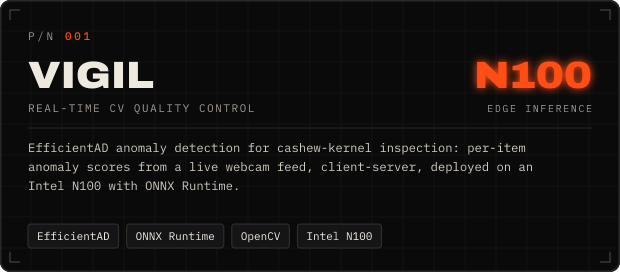</picture></a>
  <a href="https://github.com/ARASKOVA-labs/Cerberus-oss"><picture><source media="(prefers-color-scheme: light)" srcset="assets/light/card-cerberus.svg">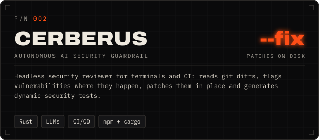</picture></a>
  <a href="https://anvinpshibu.com/projects"><picture><source media="(prefers-color-scheme: light)" srcset="assets/light/card-argus.svg"></picture></a>
  <a href="https://anvinpshibu.com/projects"><picture><source media="(prefers-color-scheme: light)" srcset="assets/light/card-triage-x.svg">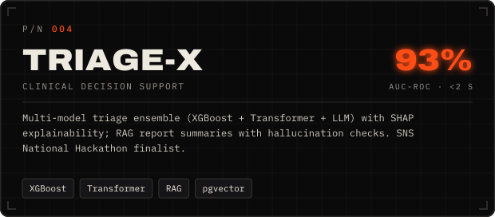</picture></a>
  <a href="https://anvinpshibu.com/projects"><picture><source media="(prefers-color-scheme: light)" srcset="assets/light/card-retina-q.svg">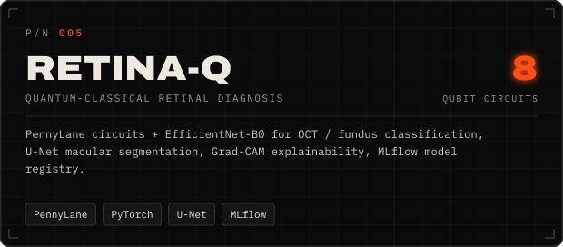</picture></a>
  <a href="https://www.npmjs.com/package/specter-kit"><picture><source media="(prefers-color-scheme: light)" srcset="assets/light/card-specter.svg"></picture></a>
  <a href="https://github.com/Samurai-goose/Tesserin-pro"><picture><source media="(prefers-color-scheme: light)" srcset="assets/light/card-tesserin.svg">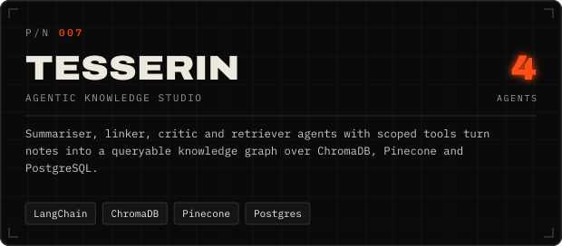</picture></a>
  <a href="https://anvinpshibu.com/projects"><picture><source media="(prefers-color-scheme: light)" srcset="assets/light/card-edgeshield.svg">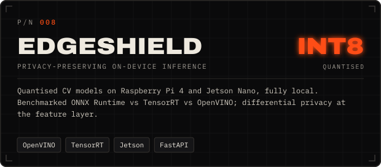</picture></a>

  <b>Also on the bench:</b>
  <a href="https://github.com/ARASKOVA-labs/Aerial">Aerial</a> (120 FPS Rust/WASM canvas) ·
  <a href="https://github.com/Anvinpshibu/PDFGOD">PDFGOD</a> (raw notes → polished PDFs) ·
  <a href="https://github.com/Anvinpshibu/Garuda">Garuda</a> (crowd analytics) ·
  <a href="https://github.com/Anvinpshibu/LUMINA-annotator">LUMINA</a> (CV annotator) ·
  <a href="https://github.com/Anvinpshibu/Eridian">Eridian</a> (local-first AI canvas)

<picture><source media="(prefers-color-scheme: light)" srcset="assets/light/plate-04.svg"></picture>

**B.E. Computer Science and Engineering**, Sri Ramakrishna Engineering College, Coimbatore (Anna University), 2022–2026.
I was a NEET aspirant first. That didn't work out, so I took a sharp left turn: **data → ML → AI**, and **SI** next.

Certifications: Deep Learning Specialization, LangChain for LLM Apps and Building Systems with the ChatGPT API (DeepLearning.AI) · LLMs and Responsible AI (Google Cloud) · Vector Search (Pinecone) · Kubernetes (Linux Foundation) · AWS Cloud Practitioner.
Community: organiser of the AI08 open-source AI community · NLP / ML workshops for 100+ students · hackathon mentor at SREC.

<picture><source media="(prefers-color-scheme: light)" srcset="assets/light/plate-05.svg"></picture>

  <picture><source media="(prefers-color-scheme: light)" srcset="https://skillicons.dev/icons?i=py,pytorch,tensorflow,sklearn,opencv,rust,ts,react,nextjs,threejs,tauri,electron,bun,fastapi&theme=light&perline=14"></picture>
  <picture><source media="(prefers-color-scheme: light)" srcset="https://skillicons.dev/icons?i=flask,postgres,redis,mongodb,sqlite,docker,kubernetes,aws,gcp,cloudflare,vercel,linux,git,githubactions&theme=light&perline=14"></picture>

  
  
  
  

<picture><source media="(prefers-color-scheme: light)" srcset="assets/light/plate-06.svg"></picture>

<picture><source media="(prefers-color-scheme: light)" srcset="https://raw.githubusercontent.com/Anvinpshibu/Anvinpshibu/output/laser-commits-light.svg"></picture>

  <picture><source media="(prefers-color-scheme: light)" srcset="https://github-readme-stats.shion.dev/api?username=Anvinpshibu&show_icons=true&include_all_commits=true&count_private=true&bg_color=FFFFFF&title_color=FF4D12&text_color=0A0A0B&icon_color=FF8A3D&border_color=E2DDD4"></picture>
  <picture><source media="(prefers-color-scheme: light)" srcset="https://github-readme-stats.shion.dev/api/top-langs/?username=Anvinpshibu&layout=compact&count_private=true&bg_color=FFFFFF&title_color=FF4D12&text_color=0A0A0B&border_color=E2DDD4"></picture>

<picture><source media="(prefers-color-scheme: light)" srcset="https://streak-stats.demolab.com/?user=Anvinpshibu&background=FFFFFF&border=E2DDD4&stroke=E2DDD4&ring=FF4D12&fire=FF8A3D&currStreakNum=0A0A0B&currStreakLabel=FF4D12&sideNums=0A0A0B&sideLabels=6E6962&dates=A8A29A"></picture>

<picture><source media="(prefers-color-scheme: light)" srcset="https://github-readme-activity-graph.vercel.app/graph?username=Anvinpshibu&bg_color=FFFFFF&color=6E6962&line=FF4D12&point=0A0A0B&area=true&area_color=FF4D12&hide_border=true&custom_title=Training%20run%20%C2%B7%20contributions"></picture>

<picture><source media="(prefers-color-scheme: light)" srcset="assets/light/plate-07.svg"></picture>

<a href="https://anvinpshibu.com"><picture><source media="(prefers-color-scheme: light)" srcset="assets/light/endcard.svg"></picture></a>

  

<i>Every plate here is generated by <code>scripts/readme/</code> from the fonts and palette of anvinpshibu.com. The laser re-burns the contribution graph every 6 hours.</i>
